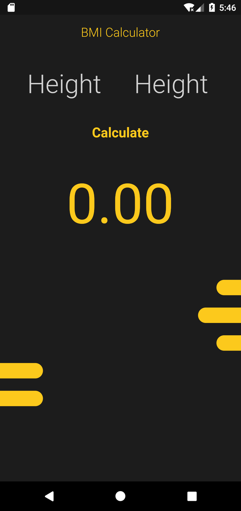
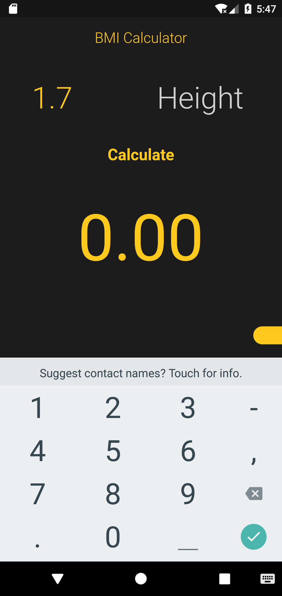
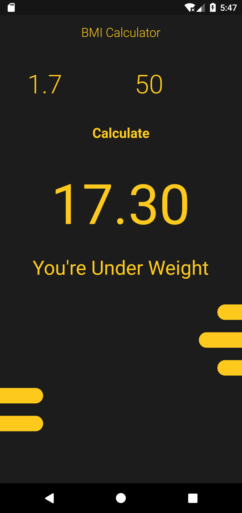

# BMI Calculator Using Flutter
 Calculator for BMI Index in Flutter with Material Design.
  
 A beginners project to get introduce to the flutter development environment.
 
 ## Snapshots
 &nbsp;  &nbsp; 
 
 Indexing Snapshots
 1. Home Page UI
 2. Input for weight and height
 3. BMI result with text result

## Reference
For help getting started with Flutter, view [online documentation](https://flutter.dev/docs), which offers tutorials, samples, guidance on mobile development, and a full API reference.
